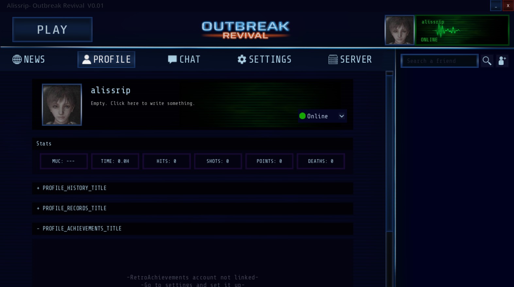
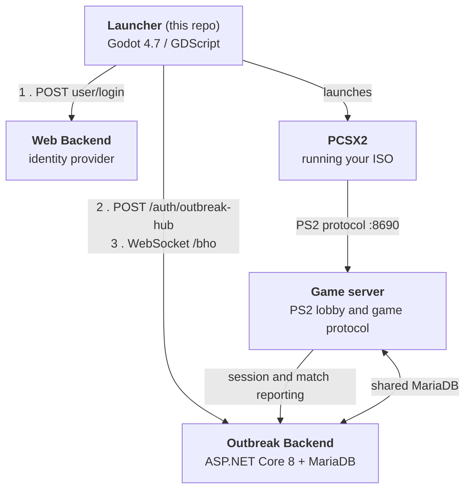

<p align="center">
  
</p>

# Outbreak Revival

A desktop launcher that makes *Resident Evil Outbreak File #1* (PS2, `SLPM-65428`) playable online
without fighting an emulator first. It runs the game inside PCSX2 and layers a modern online service
on top: accounts, friends, chat, matchmaking, in game presence, records and achievements.

---

## Before anything else

I want to clear a few things up first.

This started as a personal project, with the simple goal of improving the rough experience of playing
*Resident Evil Outbreak* on the Outbreak Resurrection infrastructure.

I want to thank **OBSRV** for their astonishing reverse engineering work on the *Resident Evil
Outbreak* servers, and for keeping this community alive for so many years. Without them this project
would not have been possible at all.

As I built it, it grew to a scale I never imagined. My ambition took me down a road that ended in
this complete little project. Once it was that big, I naturally wanted to share it with the world. I
wanted to offer a tool that makes *Resident Evil Outbreak* more pleasant and more modern for
everyone, and to bring new players to a game that most people would otherwise never give a chance,
simply because setting it up is so rough. Configuring an emulator alone can be a lethal barrier for
an average user who just wants to try something out. This game deserves that chance as much as any
new release does.

The Outbreak Resurrection community did not want to integrate the project. It was dismissed and
rejected, with the suggestion that I was trying to steal the legacy they had built over years of
running a community. That is not true, and I assume it was a misunderstanding. It was also a
misunderstanding they were not willing to resolve. They focused instead on spreading more confusion
and accusing me of things I never intended, whether because they were genuinely confused or out of
malice, despite my repeated attempts to defend the project and my intentions.

So, to be clear about where I stand: I am enormously grateful to them and I value their work, and
without it none of this would exist. I also do not want any kind of relationship with them, and I do
not want to be associated with their community. I don't want any more of the trouble they caused me,
and I don't want to keep being defamed.

One more thing, and it should go without saying. **I have nothing to do with Capcom.** This is an
unofficial fan project, made by one person, with no affiliation with, endorsement by, or connection
to Capcom or any of its subsidiaries or partners. *Resident Evil*, *Biohazard*, *Outbreak* and every
related name, character and logo belong to Capcom. I do not own any of it and I do not claim to.
Nothing here contains or distributes any part of the game: you bring your own disc image and your own
BIOS, and this launcher only orchestrates the emulator that runs them. No money is made from this,
and nothing is sold.

This code was originally going to stay private. I'm publishing it because it would be a shame to
delete it or hide it away, so I'm releasing it as a portfolio piece.

With that said, you can find more detailed information about the project's features on my website:
**<https://alissrip.net/outbreak/main>**

Now, on to installing and setting it up.

---

## What this is

A Godot 4.7 desktop application (GDScript) that acts as an online front end for the game. It is not
the game, and it never ships game data:

- It validates **your own** ISO by parsing the disc serial out of `SYSTEM.CNF`, which must be
  `SLPM-65428`.
- It validates **your own** PS2 BIOS by MD5.
- It downloads and manages its own PCSX2 build and its own game server binary at runtime.

Everything else, meaning the account system, the social features and the records, is a custom service
stack described below.

<p align="center">
  
</p>

## Architecture

Four moving parts. Only the first one lives in this repository.



### How the two backends relate

They are deliberately separate services with different jobs. This is the part worth understanding
before you try to run any of it.

**Web Backend** is the identity provider. It owns the account records, the same ones used by the
website, and it does one thing for the launcher: it verifies a username and password and issues a
signed JWT. It also serves the news articles shown on the launcher's front page. It knows nothing
about the game.

**Outbreak Backend** is the game service. It never stores or sees passwords. It trusts tokens the Web
Backend issued, by validating them against a **shared signing secret** that both services must be
configured with. Once it accepts that token it mints its own, and from then on everything runs
against the Outbreak Backend: presence, friends, chat, records and matchmaking.

So the login handshake is three steps:

1. Launcher sends username and password to the **Web Backend** and gets a Web Backend token.
2. Launcher hands that token to the **Outbreak Backend** at `/auth/outbreak-hub`. It validates the
   signature, lazily creates or links the corresponding hub account, and returns its own token plus
   the user's id and nickname.
3. Launcher opens a WebSocket to the Outbreak Backend at `/bho?token=<that token>` and holds it open
   for the whole session.

The practical consequence: **the shared JWT secret is the coupling point.** If the two services
disagree on it, login fails at step 2 with a perfectly valid password. That is the single most common
way to get this stack wrong.

### The game server

The **game server** is a separate project with its own repository. It speaks the original proprietary
PS2 binary protocol to an unmodified game client, and it is the piece that actually hosts matches.
The launcher downloads it, installs it alongside a bundled JDK, and can run it locally so you can
host your own co op server. It reports sessions and finished matches back to the Outbreak Backend,
and the two share the same database.

Nothing about that server lives here. `Scripts/Java Server/JavaServerController.gd` is only the
launcher side supervisor: it downloads the release, verifies its hash, starts the process and drives
the heartbeat and registration handshake.

## Requirements

To play:

- A legally owned disc image of *Resident Evil Outbreak File #1*, serial `SLPM-65428`.
- A PS2 BIOS dump.
- Linux or Windows.

Neither is distributed here and neither ever will be.

To build:

- [Godot 4.7](https://godotengine.org/), standard build. No C# needed.

To run the server side, additionally:

- .NET 8 SDK
- MariaDB or MySQL
- JDK 17 for the game server

## Setting up the launcher

### 1. Configure the endpoints

Every remote address the launcher talks to lives in `endpoints.cfg`, which is **gitignored**. The
repository ships `endpoints.example.cfg` as a template. Copy it and fill it in:

```bash
cp endpoints.example.cfg endpoints.cfg
```

| Key | What it is |
| --- | --- |
| `outbreak_backend_api` | Base URL of the Outbreak Backend (REST). |
| `outbreak_backend_api_dev` | Same, used in debug builds when `SKIP_DEV_AND_USE_PROD` is off. |
| `outbreak_backend_ws` | WebSocket URL of the Outbreak Backend. The `/bho` path is appended. |
| `outbreak_backend_ws_dev` | Same, for debug builds. |
| `web_backend_api` | Base URL of the Web Backend, **with a trailing slash**. `user/login` and `article/get` are appended to it. |
| `resource_base` | Base URL avatars and user resources are served from. |
| `website` | Public site base. Register, password recovery and guide links are built from it. |
| `game_servers` | Region to IP map for the official servers shown in the server list. |
| `ps2_dns` | DNS address written into the emulated PS2's network config. |
| `dnas_host`, `kddi_host` | Host redirects written into the PCSX2 network host table. |
| `editor_base` | Local path used to find PCSX2 when running from the Godot editor. Leave empty to use the project directory. |

Without this file the project still opens and compiles. It simply cannot reach anything, and logs
`endpoints.cfg missing`.

> The file is included in exported builds via `include_filter` in `export_presets.cfg`, so it is
> bundled at export time rather than shipped in the repo.

### 2. Run it

```bash
godot -e --path .          # open in the editor
godot --path .             # run directly
```

### 3. Export

```bash
godot --headless --export-release "Outbreak" <output>          # Linux
godot --headless --export-release "Windows Desktop" <output>   # Windows
```

## Setting up the Outbreak Backend

The backend is an ASP.NET Core 8 application and is not in this repository.

```bash
dotnet run --project <backend project>   # listens on http://127.0.0.1:5001 by default
```

Its `appsettings.json` is gitignored and must be created locally with four values:

| Key | What it is |
| --- | --- |
| `ConnectionStrings:DefaultConnection` | MariaDB or MySQL connection string. |
| `Jwt:Secret` | HMAC secret used to sign the backend's own tokens. |
| `RedEye:Url` | Base URL of the Web Backend. |
| `RedEye:JwtSecret` | The Web Backend's signing secret. Must match the one the Web Backend uses, per the handshake above. |

In `DEBUG` plus Development builds the `/bho` WebSocket accepts a `?userId=` parameter directly
instead of validating a token, and an extra `dev-login` endpoint is exposed. Both are development
shortcuts and must stay off in production.

### Database

MariaDB or MySQL, accessed through EF Core with the Pomelo provider.

There are **no EF migrations in the project**, so the schema is not created for you. The database has
to exist with the right tables before the service will start. Two families:

- **`ob_*` and `user`**, the older game server schema: `user`, `ob_users`, `ob_sessions`,
  `ob_hnpairs`, `ob_gameservers`, `ob_motd`. These are what the game server reads and writes, and
  where legacy accounts live.
- **`obh_*`**, the Outbreak Hub tables added by this project: `obh_user`, `obh_friends`,
  `obh_messages`, `obh_global_message`, `obh_records`, `obh_achievements`, `obh_match_history`,
  `obh_match_players`, `obh_active_matches`, `obh_ingame_data`, `obh_servers`, `obh_meta`,
  `obh_scenario_meta`.

`obh_meta` and `obh_scenario_meta` are lookup tables holding character, scenario and difficulty
names, plus per scenario max progress. They are loaded into memory at startup, so they must be
populated or the service comes up with empty metadata.

## What the Web Backend has to provide

If you are substituting your own identity service, it needs to satisfy a small contract:

| Endpoint | Method | Request | Response |
| --- | --- | --- | --- |
| `user/login` | POST | `{"Username": ..., "Password": ...}` | `200` with `{"token": ...}`, or `401` on bad credentials |
| `article/get` | GET | no parameters | a JSON **array** of articles, each with `category`, `title`, `description`, `imagePath` |

The token returned by `user/login` must be a JWT signed with the same secret configured as
`RedEye:JwtSecret` on the Outbreak Backend.

`article/get` returns every article. The launcher filters to categories `3` and `4` and paginates
client side, so the endpoint needs no paging support. `imagePath` is fetched as is, so it must be an
absolute URL.

## Ports

| Port | Used by |
| --- | --- |
| `8690` | Game server, game traffic. Must be open to host. |
| `8300` | Lobby server. |
| `5001` | Outbreak Backend, local default. |

## Repository layout

| Path | |
| --- | --- |
| `Scripts/Network/` | REST handlers, one per domain, plus the `Endpoints` config loader. |
| `Scripts/Network/RPC Scripts/` | WebSocket JSON-RPC client, feature modules and the user cache. |
| `Scripts/Emulator/` | PCSX2 integration: paths, ini, graphics, controls, PINE IPC, anti cheat. |
| `Scripts/UI/` | Main view modules and profile subsystems. |
| `Scripts/UI State Machine/` | Login, loading and main state machine. |
| `Scripts/Java Server/` | Downloads, installs and supervises the game server process. |
| `Localization/` | `translations.csv`, all user facing strings. |

## A note on the assets

**Every piece of artwork still in this repository was made by me.** The sprites, the icons, the
borders and frames, the loading spinners, the gradients, the status bars, the logo and the banner art
are all my own work.

What you will not find is anything I did not make. Character renders, achievement badges, PlayStation
button glyphs, the title video and the music were taken out and replaced with flat colour
placeholders at their original dimensions, so every scene reference still resolves. The launcher
runs, and it will not look like the screenshots on the site.

**The interface sounds are silent for the same reason.** They were recorded straight from the game,
which makes them Capcom's and not mine, so they had to go. The files are still in place at their
original lengths, holding nothing but silence, which keeps the audio system working exactly as it
did. The same applies to the background music and the title video.

Fonts are the one exception to all of this. They are third party and redistributable, and their
licences are in `LICENSES/`.

## Licence

This repository is released under the **PolyForm Strict License 1.0.0**. The full text is in
[`LICENSE`](LICENSE). In short:

- Private, personal, experimental and hobby use is permitted. So is use by noncommercial
  organisations.
- The source is here to be read and studied.
- Redistributing it, publishing modified versions, and any commercial use are **not** granted by the
  licence itself.

These terms are *source available* rather than open source in the OSI sense, since they restrict what
you may do with the software.

### Asking for more than the licence grants

The licence is the floor, not the ceiling. I am genuinely open to granting permission beyond it, for
forks, redistribution, running your own public instance, or anything else. Write to
<alissrip54@gmail.com> and tell me what you want to do and why. A reason that convinces me is all it
takes, and I would rather say yes to someone who asked than find out afterwards.

That openness rests on trust. If someone takes what was not given, or abuses permission I granted, I
will enforce this licence exactly as it is written.

This repository does not accept pull requests, and any that are opened are closed automatically.
Merging outside contributions would mean publishing a modified version, which is exactly what the
licence does not grant. Email is the way in.

Two things fall outside this licence. The game server is a separate project with its own repository
and its own licence. The fonts under `Fuentes/` are third party and carry the SIL Open Font License
1.1, reproduced in `LICENSES/`.
